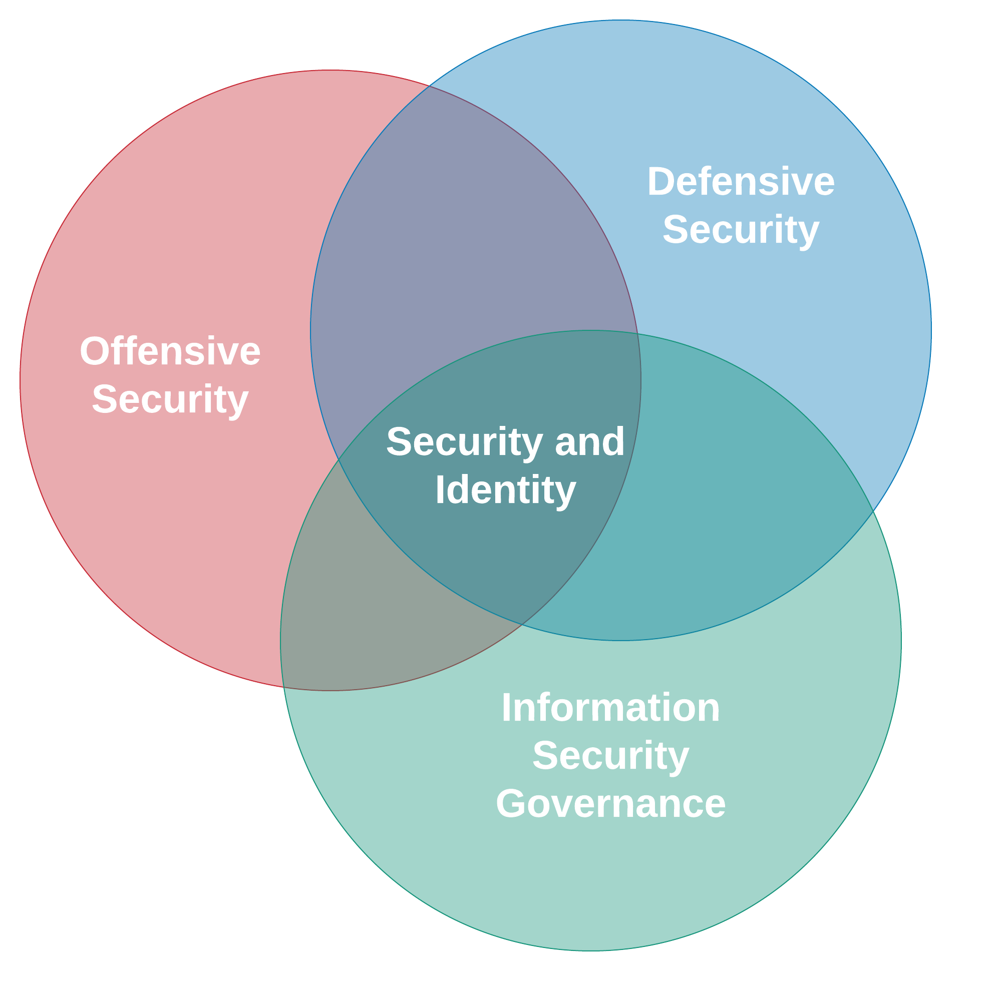

# Security and Identity Team

When Privacy-Preserving Machine Learning (PPML) arrives into the mainstream, the effects will be felt in every sector of the data industry. We aim to help the AI community brace for impact by exploring the still uncharted area around security appraisal, trust and governance mechanisms relating to PPML.

## Our roadmap for 2020

<b>COVID-19 Self-Sovereign Identity (SSI)</b>

We aim to create free education and tools aimed at onboarding COVID app developers into working with self-sovereign identity (SSI) principles:

- We are working with the writing team to create free education around SSI.
- We are working on a branch of Opus, which will extend Opus with full SSI credential creation, issuance, verification and revocation functionality. This will ultimately allow Opus to provide SSO services upon the receipt of valid proofs from a user relating to that particular identity; no further information is required.
- We are working with the Sovrin foundation as a greater community on establishing credential and governance standards for dealing with the swathes of data surrounding COVID. We are building standard tooling for working with the established data types.

<a href="./projects/COVID-SSI/COVID-SSI.md">An overview of this project can be seen here.</a>

<b>Recommendation of Standard Governance Frameworks for PPML</b>

Governance models are important because they bridge the gap between what is possible and what is legislatively justifiable. Businesses need to know why PPML is important, why it's going to save them resources in information security management and, most importantly, how they can justify it to their auditor. To this end we are working on recommendations and documenation around the following:  

- Recommendation of incident response standard guidelines concerning PPML security incidents 
- Exploring appropriate design ethics for privacy-preserving systems 
- Exploring PPML feasability with respect to existing legislative requirements (GDPR, HIPAA) 
- PPML Risk Management Exploration and Documentation 
- Integration and assimilation with existing InfoSec Standards (ISO 27000, NIST) 
- Recommendation of Standard PPML Security 

<b>Documentation and Security Audit of Privacy-preserving Tools and Workflows</b>

There are existing tools and workflows in PySyft which have never been used in industry. It's our obligation before recommending the use of these tools to first explore them with a sceptical eye. Under this objective, we develop documentation surrounding tools including their known applications, privacy and security constraints and resource constraints. We are exploring tools under the following taxonomical branches:

- PPML Differential Privacy Mechanisms  
- PPML Cryptographic mechanisms  
- PPML through Distribution of Information Assets
- Distributed Identity and Trust Mechanisms for PPML

<b>Appraisal and Documentation of Existing Attacks on Learning Models</b>

Privacy-preserving techniques distribute computation in order to ensure that data remains in the control of the owner while learning takes place. However, architectures distributed amongst multiple agents introduce an entirely new set of security and trust complications. These include data poisoning and model theft.

We work on documenting and creating free education materials for attacks on AI applications. We do this with the intention of raising awareness amongst the community who are implementing applications, In turn this should encourage best practices.

<b>Application Level Architecture Documentation and Security Audit</b>

We will be working with the Syft team, Web and Mobile team and the PyGrid team to create architecture documentation and monitor dependencies for vulnerabilities and apply recommended information governance systems.  

<b>Network Level ArchitectureDocumentation and Security Audit </b>

We perform security audit on live hosts running Grid services as well as demonstrate leakage network captures on post-mortem data. We use these experiments to monitor for leakage in the OM stack and provide ammunition for forensics or CTF challenges.

<b>CTF, Forensics and Performance Challenges</b>

We aim to organise events around breaking and improving upon our tools. These fall under the following categories:

- Live CTF network-based Attacks
- Forensics Challenges
- Bug-bounties
- Performance Optimisation Challenges

<b>SplitNN Standard Class Type Development and Hardening against Information Leakage</b>

Traditionally, PySyft has been used to facilitate federated learning. However, we can also leverage the tools included in this framework to implement distributed neural networks. These allow for researchers to process data held remotely and compute predictions in a radically decentralised way. First introduced by MIT in December 2018, SplitNNs represent a brand new architectural mechanic for privacy-preserving ML researchers to play with. <b> We have built the worlds first fully open-source implementation of Split Neural Networks. </b>

While SplitNNs are an interesting architectural development, they are far from being a secure distributed learning method. The issues here are documented in <b><a href="documentation/tools/DoIA/SplitNN/VulnA.pdf">vulnerability A </a></b> and <b><a href="documentation/tools/DoIA/SplitNN/VulnB.pdf"> vulnerability B</a></b>. We are currently working on methods to counter these vulnerabilities.

<b>PyGrid SSI Integration</b>

We aim to use Hyperledger Aries as a mechanism to facilitate trust in PyGrid. More details to come.

<b>Zero-Knowledge Data Discovery and Transport (ZK-Alexandria)</b>

##### <u>Get in touch if you'd like to know more about this project!</u>

<b>Design PySyft Data Object Access Control Mechanism</b>

We will be working with the PySyft team to desing an implement an object access management system.  

## Team Members

The team leader is [**Adam James Hall**](https://github.com/H4LL). Our team is comprised of the following people.

<table>
  <tr>
    <td align="center">
      <a href="https://github.com/H4LL">
        
         <b>Adam James Hall</b></a> 
        Team Lead
      </a>
    </td>
    <td align="center">
      <a href="https://github.com/LaRiffle">
        
         <b>Théo Ryffel</b></a> 
        PPML + Cryptography
      </a>
    </td>
    <td align="center">
      <a href="https://github.com/wip-abramson">
        
         <b>Will Abramson</b></a> 
        Self-Sovereign Identity
      </a>
    </td>
  </tr>
  <tr>
  <td align="center">
    <a href="https://github.com/pavlos-p">
      
       <b>Pavlos Papadopoulos</b></a> 
      PPML + Security Audit
    </a>
  </td>
    <td align="center">
      <a href="https://github.com/tremblerz">
        
         <b>Abhishek Singh</b></a> 
        Split Neural Networks
      </a>
    </td>
    <td align="center">
      <a href="https://github.com/FarrandTom">
        
         <b>Tom Farrand</b></a> 
        Privacy-Preserving ML
      </a>
    </td>
  </tr>
  <tr>    
  <td align="center">
        <a href="https://github.com/JulianSprung">
          
           <b>Julian Sprung</b></a> 
          Security + Performance Challenges
        </a>
      </td>
  <td align="center">
    <a href="https://github.com/youben11">
      
       <b>Ayoub Benaissa</b></a> 
      CrypTen integ. + TenSEAL
    </a>
  </td>
    <td align="center">
      <a href="https://github.com/setiadeepanshu">
        
         <b>Deepanshu Setia</b></a> 
        Privacy-Preserving ML
      </a>
    </td>
  </tr>  
  <tr>
  <td align="center">
    <a href="https://github.com/ttitcombe">
      
       <b>Tom</b></a> 
      Privacy-Preserving ML
    </a>
  </td>
  <td align="center">
    <a href="https://github.com/40415056">
      
       <b>Afzaal Hussain</b></a> 
      Information Security Governance
    </a>
  </td>
  </tr>
</table>

## Projects

Learn more about our projects:

<a href="https://github.com/OpenMined/PySyft/tree/master/examples/tutorials/advanced/split_neural_network"><b>Open-source</b> implementation of <b>Split Neural Networks</b> </a>

<a href="./projects/COVID-SSI/COVID-SSI.md">COVID-19 Open-Source SSI Project</a>

<a href="https://github.com/OpenMined/aries-fl">A Distributed Trust Framework for Privacy Preserving Machine Learning</a>

ZK-Alexandria

More coming soon...

<!-- ## Weekly Meetings

We have weekly meetings that are currently private, [but we take detailed notes for each meeting](./meetings). Here you can will find our weekly status updates: where each member of our team has recorded what they worked on the previous week and what they plan to work on in the upcoming week. -->

<!-- ## Contact

### Want to join?

If you're already a contributor to PySyft, and if you're interested to to work on crypto related use cases, you should definitely join us!

*[Apply to the crypto team!](https://docs.google.com/forms/d/1T6MJ21V1lb7aEr4ilZOTYQXzxXP6KbpLumZVmTZMSuY/edit)* -->

### Looking for a Project?

<b><a href="workmap.pdf"> Feel free to run with anything on our Workmap!</a></b>

### Have questions?
- [**@Adam J Hall** on Slack](https://app.slack.com/client/T6963A864/C69RB18LA/user_profile/UFQ4YUPMJ)
- [**@Adam James Hall** on Linkedin](https://www.linkedin.com/in/adam-james-hall-1b0229113/)
- [**@AJH4LL** on Twitter](https://twitter.com/AJH4LL)
- <b>Email: Adam@napier.ac.uk </b>
