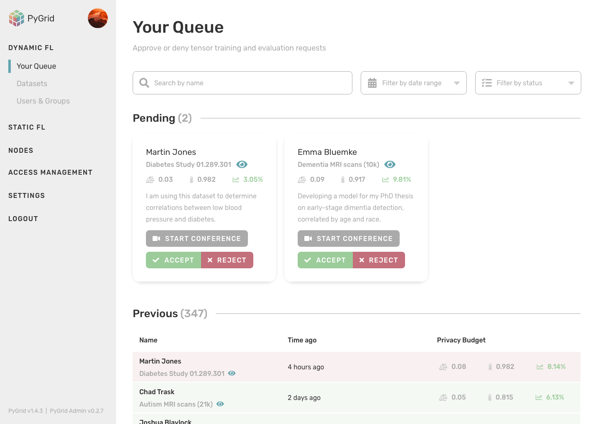
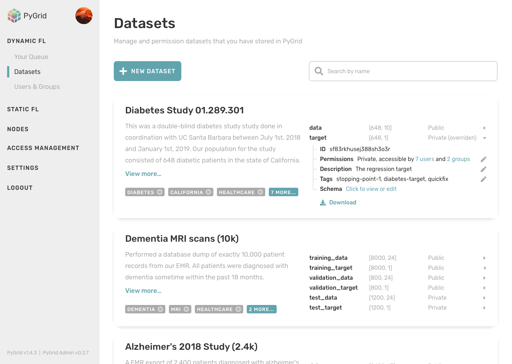
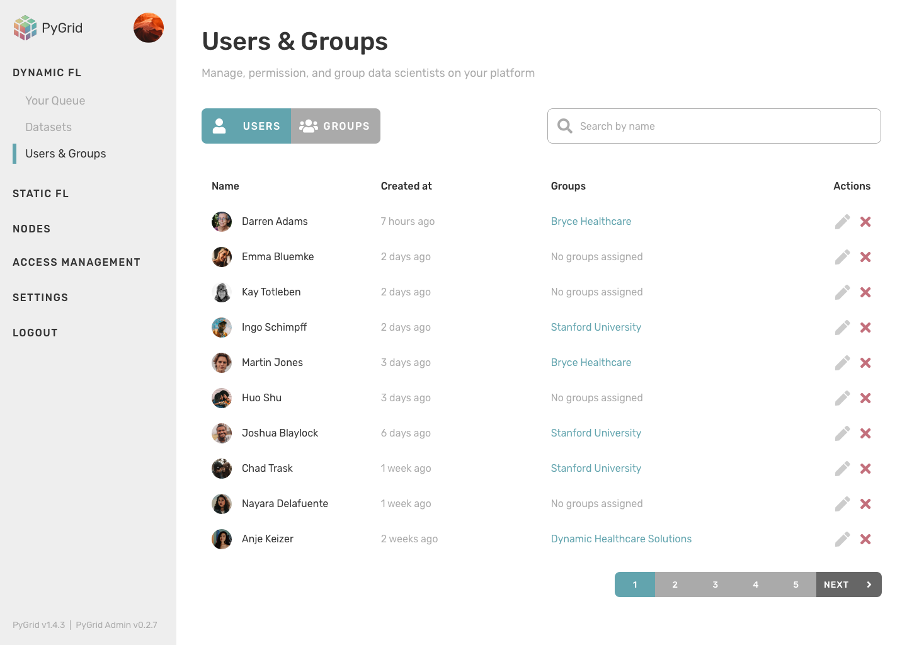
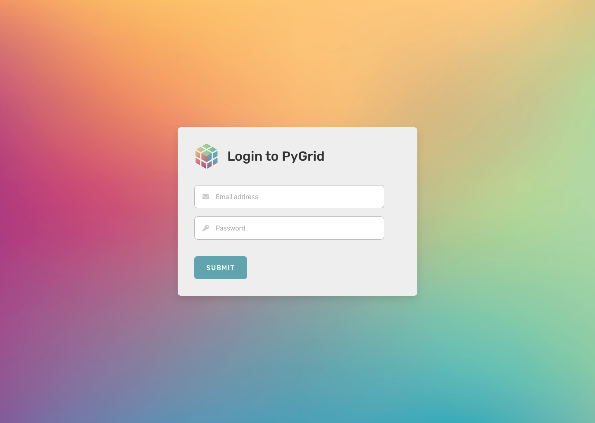

## Introduction

_Last modified: May 29th, 2020_

The PyGrid Admin UI for dynamic federated learning is fairly simple, consisting of a Login page and 3 main core pages of functionality:

#### Your Queue

This is where a grid admin or data compliance officer will triage incoming model training and inference requests. Users for this view have the ability to also schedule a video and audio conference with the data scientist themselves. It's not likely that this will be functionality that's available in our MVP.

#### Datasets

This is where a grid admin will manage all private datasets hosted within their PyGrid gateway, as well as the permissions of those datasets.

#### Users & Groups

This is where a grid admin will manage all users currently allowed to interact with datasets; create, edit, or delete users; and place users into groups. They will also be allowed to set base level user permissions and provision per-user privacy budgeting allocations here.

---

#### Login

Login is fairly straight-forward and does not need additional context.

### Component System
We are creating a component system, built in React, that will be used in the PyGrid Admin UI, as well as within every UI that OpenMined publicly produces. This UI system is called `openmined-ui` and will be available to the public for use in community-driven user interfaces as well.

The component system will also attempt to automate a large amount of build system tasks related to setting up a proper development environment, build systems, and deployment. It's currently uncertain if these two systems will be implemented together or separate. The most likely scenario is that we will create a UI component system, which is standalone, but also defaultly installed as a dependency in the build system. This will also ensure that beginners are able to contribute to OpenMined's various user interfaces, without needing to know anything about how to create scalable front-end web applications.

### Scaling and Infrstracture
Since the user interface is simply a series of static files, hosting may be done by cloning the Github project to any file server. If the network administrator prefers, they may also use any of the various one-click deploy buttons in the Github project. Since the UI is separate from the PyGrid application entirely, the scaling concerns are separated.

### Future Plans
The PyGrid Admin, as far as this roadmap is concerned, will encompass only dynamic federated learning. However, there is a great deal of functionality that will be planned for subsequent releases. We also intend to eventually release functionality related to static federated learning, as well as monitoring and scaling of compute resources associated with your PyGrid Gateway.

OpenMined intends to also host a public version of this entire user interface on their website at some web address to be announced at a later date. This means that, technically speaking, nobody needs to host the UI themselves unless they need specific control over the branding and identity. The UI hosted by OpenMined will be kept up to date, but it will be the responsibility of those managing a custom deployment of the PyGrid Admin UI to update their installations manually.

---

_Additional reference for approve/deny process: https://github.com/OpenMined/PyGrid/issues/213#issuecomment-547864809_