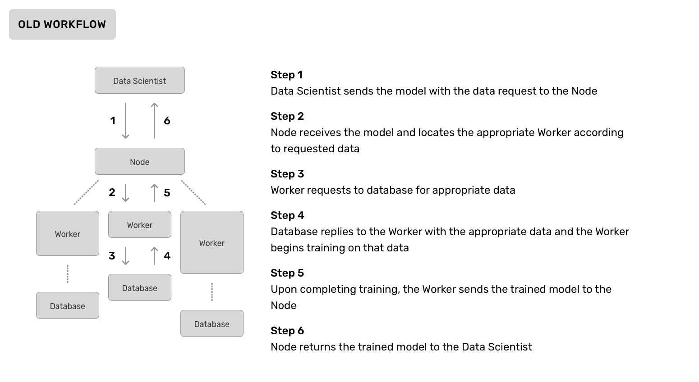
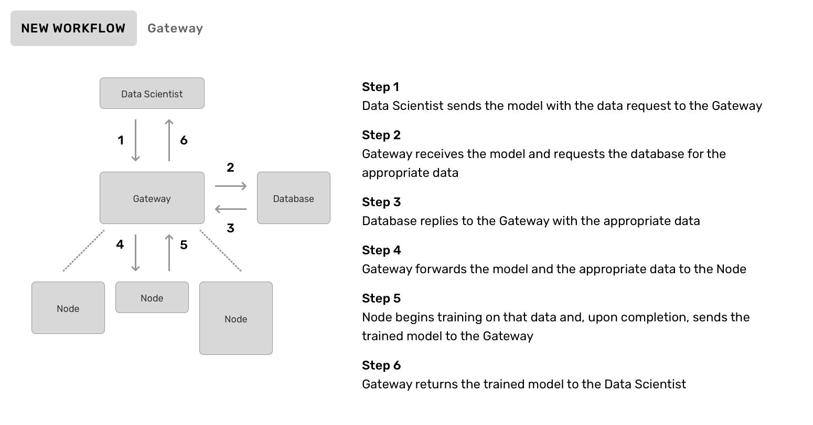
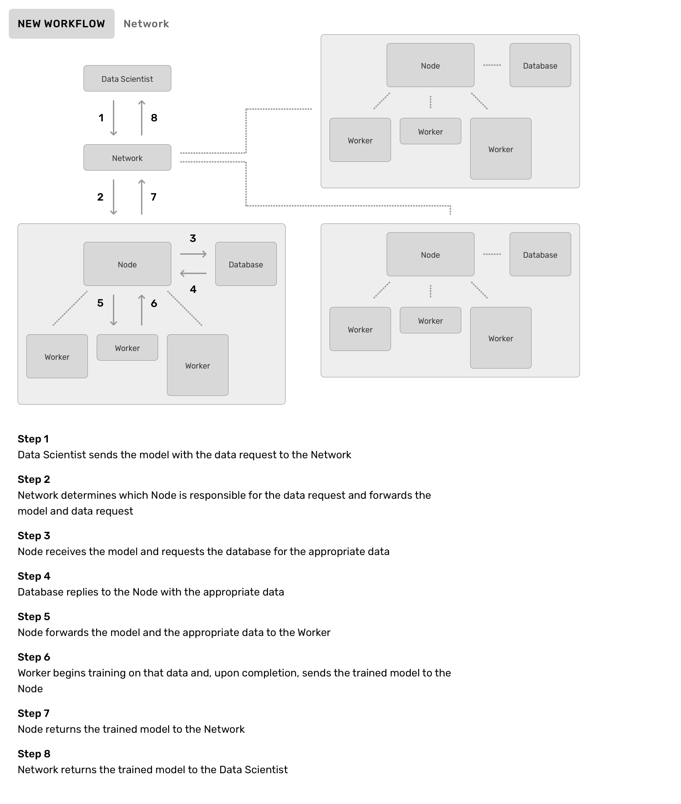

## Introduction

_Last modified: April 25th, 2020_

PyGrid will need to undergo a major organizational refactor in order to appropriately scale to the requests of the community. This involves shifting around existing components of the codebase, migrating databases from one project to another, and even creating new components altogether. The current organizational structure is detailed in the image below:

_Note: All diagrams in this document contain Nodes of different sizes, this indicates that they may scale their compute resources independent of other Nodes in the Gateway._

While the new workflow will look similar, the key difference is in the way PyGrid integrates with various databases. Currently, each Node in a PyGrid Gateway maintains its own database and each of those databases are kept separate from the other Nodes in the cluster. **Going forward, we are migrating to use one database at the root of the project. This database will only be connected to via the Gateway itself, meaning that Nodes will only be responsible for computing (evaluating or training) on that data.** This is explained in the following image:

There's one other component that doesn't currently exist: the Network. Networks are an **optional** top layer of connectivity, allowing multiple PyGrid Gateways to be linked to one another and queried simultaneously. For instance, if a hospital network desires to have all of the data of all of their hospitals queryable, yet still give privacy and autonomy to an individual hospital, they may do so using a Network. This allows data scientists immense flexibility in that they do not need to be concerned with which specific Gateway has the data they need, so long as the Network can federate their requests to the appropriate one. This is explained in the following image:

